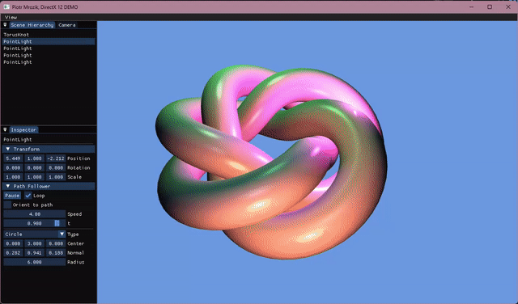

# DX12 Renderer

> A real-time 3D renderer built from scratch in DirectX 12 — a portfolio project exploring modern GPU programming, low-level graphics APIs, and game engine architecture.


---

<p align="center">
  
</p>

<p align="center"><em>Torus knot with Blinn-Phong multi-light shading.</em></p>

---

## Overview

This project is a ground-up DirectX 12 renderer written in C++17. The goal is to learn and demonstrate modern graphics programming concepts - explicit GPU synchronisation, multi-buffered rendering, MSAA, and a data-driven **Entity-Component-System** architecture - without hiding complexity behind a high-level engine.

The codebase is split into two clean layers:

| Target | Type | Role |
|--------|------|------|
| **Engine** | Static library | DX12 infrastructure, ECS, camera, UI layer, math abstractions |
| **Sample** | WIN32 executable | Concrete demo scene — grows with each feature |

---

## Features

### Rendering
- **DirectX 12** — explicit command lists, command queues, and resource management
- **Triple-buffered swap chain** — `IDXGISwapChain4`, 3 back buffers, per-frame fence tracking
- **4× MSAA** — multisampled colour + depth targets with a 5-phase resolve pass
- **Blinn-Phong shading** — ambient + diffuse + specular in HLSL, evaluated per-fragment
- **Multi-light support** — multiple point lights processed in a single shader pass via `PointLightSystem`
- **GPU-based validation** in Debug builds for catching API misuse early
- **VSync toggle** and **borderless fullscreen**

### Scene & ECS
- **Entity-Component-System** — data-driven scene graph with dense-packed component storage
- **PathFollower system** — entities animate along **Bezier** or **Circle** paths at runtime
- **PointLightPrefab** — convenience factory for placing point lights into the ECS world
- **Orbit camera** — mouse-driven arcball with configurable FoV zoom

### UI
- **ImGui integration** with docking layout
- **SceneHierarchyPanel** — live inspector: browse entities, inspect transform / mesh / light / path components
- **UILayer** — thin rendering layer that owns all ImGui panels, decoupled from scene logic

### Mesh
- **MeshRegistry** — named GPU mesh store with handle-based lookup
- **Procedural primitives** — Cube, Sphere, Plane, Cylinder, Torus, **Torus Knot**

### Math
- **Path abstractions** — `BezierPath` (cubic spline) and `CirclePath` for smooth entity motion

### Build & Tooling
- **CMake + vcpkg** — reproducible builds, no manual DLL management
- **Precompiled headers** — fast incremental builds via `DX12LibPCH.h`
- **HLSL compilation** integrated into CMake via `VS_SHADER_*` properties

---

## Architecture Deep-Dive

### Engine Library

```
Engine/
├── Application          Singleton — owns DX12 device + 3 CommandQueues (direct/compute/copy)
├── CommandQueue         Wraps ID3D12CommandQueue + fence; pools allocators and command lists
├── Window               Manages IDXGISwapChain4, RTV heap, vsync, fullscreen, event dispatch
├── Game                 Abstract base — MSAA resources, per-frame sync, viewport, shared helpers
├── HighResolutionClock  Delta-time and FPS measurement
│
├── ECS/
│   ├── Globals              Entity, ComponentType, EntitySignature
│   ├── EntityManager        ID recycling queue, signature storage
│   ├── ComponentArray<T>    Dense packed storage (no holes), O(1) add/remove/lookup
│   ├── ComponentManager     type_index → ComponentArray dispatch
│   ├── System               Base class; owns a filtered set of matching Entity IDs
│   ├── SystemManager        Routes EntitySignatureChanged → system entity sets
│   └── World                Public façade: CreateEntity, Add/Remove/GetComponent, RegisterSystem
│
├── Components/
│   ├── TransformComponent        position / rotation (Euler) / scale → GetWorldMatrix()
│   ├── TagComponent              string name
│   ├── MeshComponent             mesh handle (no DX objects)
│   ├── DirectionalLightComponent
│   ├── PointLightComponent       position, colour, intensity, attenuation
│   ├── PathFollowerComponent     path pointer, speed, accumulated t
│   └── RigidBodyComponent        velocity / angular velocity / mass
│
├── Systems/
│   ├── TransformSystem
│   ├── RenderableSystem
│   ├── LightingSystem
│   ├── PointLightSystem      Collects point lights and uploads them to the shader CB
│   ├── PathFollowerSystem    Advances t along a Path and writes back TransformComponent
│   └── FrameContext          Per-frame scene state passed to render systems
│
├── Camera/
│   └── OrbitCamera           Arcball orbit with configurable FoV
│
├── UI/
│   ├── UILayer               Owns the ImGui render pass and all panel instances
│   └── SceneHierarchyPanel   Entity list + per-component inspector (transform, mesh, lights, path)
│
├── Math/
│   ├── Path.h                Abstract base — Evaluate(t) → float3
│   ├── BezierPath            Cubic Bezier spline through N control points
│   └── CirclePath            Parametric circle in a given plane / radius
│
└── Mesh/
    ├── Vertex.h              Vertex layout (position + normal + UV)
    ├── MeshData.h            CPU-side vertex/index data
    ├── Mesh.h                GPU-uploaded mesh (VB + IB views)
    ├── MeshRegistry          Owns GPU meshes, Add(name, data) → handle lookup
    └── Primitives            Factory: Cube, Sphere, Plane, Cylinder, Torus, TorusKnot
```

### Sample Application

The `Sample` is intentionally thin — it only contains:
- **Scene setup** (`LoadContent`): registers primitives, spawns ECS entities (including a torus knot on a circle path with surrounding point lights), builds PSO with 4× MSAA
- **Update** (`OnUpdate`): ticks `PathFollowerSystem` + `PointLightSystem`, drives the UI layer
- **Render** (`OnRender`): 5-phase MSAA render loop → clear → draw → resolve → present → ImGui overlay

### MSAA Render Loop (5 phases)

```
1. Transition MSAA RT:  RESOLVE_SOURCE → RENDER_TARGET
2. Clear + draw to MSAA RT + MSAA depth buffer
3. Transition MSAA RT:  RENDER_TARGET → RESOLVE_SOURCE
   Transition back buf: PRESENT       → RESOLVE_DEST
4. ResolveSubresource   MSAA RT → back buffer
5. Transition back buf: RESOLVE_DEST  → PRESENT
   ExecuteCommandList + Present + WaitForFenceValue
```

---

## Prerequisites

| Tool | Minimum Version | Notes |
|------|----------------|-------|
| Windows 11 | 10.0.26100+ | Required for D3D12 |
| Visual Studio 2022 | 17.x (v143 toolset) | C++ Desktop workload |
| CMake | 3.20+ | Bundled with VS2022 or install separately |
| Windows SDK | 10.0.26100.0 | VS Installer → Individual Components |
| vcpkg | latest | Must be bootstrapped (see below) |

**vcpkg location** — must sit at `../vcpkg/` relative to this repo:
```
Desktop\Rendering_learning\
├── DX12-Playground\   ← this repo
└── vcpkg\             ← vcpkg lives here
```

---

## Setup

### 1. Bootstrap vcpkg (once)

```bat
cd C:\Users\<you>\Desktop\Rendering_learning\vcpkg
bootstrap-vcpkg.bat
vcpkg install directx-headers:x64-windows
```

### 2. Configure

```bat
cd "C:\Users\<you>\Desktop\Rendering_learning\DX12-Playground\DX12-Playground"
cmake --preset windows-vs2022
```

This generates a Visual Studio 2022 solution in `out/build/windows/`.

### 3. Build

```bat
cmake --build --preset debug      # or: --preset release
```

### 4. Run

```bat
out\build\windows\Debug\DX12Playground.exe
```

#### Optional flags

| Flag | Example | Description |
|------|---------|-------------|
| `-w` / `--width` | `-w 1920` | Window width |
| `-h` / `--height` | `-h 1080` | Window height |
| `-warp` | `-warp` | Software (WARP) adapter |

### Visual Studio IDE

1. **File → Open → CMake…** → select `DX12-Playground\DX12-Playground\CMakeLists.txt`
2. VS auto-detects `CMakePresets.json` → select `Windows x64 (VS 2022)`
3. `Ctrl+Shift+B` to build, `F5` to debug

---

## Controls

| Input | Action |
|-------|--------|
| `V` | Toggle VSync |
| `Alt+Enter` / `F11` | Toggle fullscreen |
| `Mouse drag` | Orbit camera |
| `Mouse wheel` | Zoom (FoV) |
| `Escape` | Quit |

---

## Dependencies

| Library | Source | Purpose |
|---------|--------|---------|
| `directx-headers` 1.619.1 | vcpkg | `<directx/d3d12.h>`, `<directx/d3dx12.h>` |
| `imgui` | vcpkg | Immediate-mode UI, docking branch |
| `d3d12.lib` | Windows SDK | D3D12 device, command lists, resources |
| `dxgi.lib` | Windows SDK | Swap chain, adapter enumeration |
| `d3dcompiler.lib` | Windows SDK | Runtime shader compilation |
| `wrl.h` | Windows SDK | `Microsoft::WRL::ComPtr<>` |
| GTest | vcpkg | Unit tests for ECS core |

> **Note:** This project uses the vcpkg `directx-headers` exclusively, **not** the older headers bundled with the Windows SDK. The two are not interchangeable.

---

## Roadmap

### Done
- [x] ECS-driven scene (entities with Transform, Mesh, Tag, RigidBody components)
- [x] MeshRegistry + procedural primitives (cube, sphere, plane, cylinder, torus, torus knot)
- [x] Blinn-Phong shading (ambient + diffuse + specular)
- [x] Multi-light rendering — point lights via `PointLightSystem`
- [x] OrbitCamera with FoV zoom
- [x] PathFollower system — Bezier and circle path animations
- [x] ImGui overlay with docking — SceneHierarchyPanel for runtime scene inspection

### Up Next
- [ ] GPU constant buffer per entity (CB-per-draw or instancing)
- [ ] Texture loading (WIC / DirectXTex)
- [ ] Shadow mapping (directional light)
- [ ] Deferred shading G-buffer pass

---

## Project Structure

```
DX12-Playground/              ← repo root
├── README.md
├── LICENSE
├── docs/                     ← reference documents and media assets
└── DX12-Playground/          ← CMake source root
    ├── CMakeLists.txt
    ├── CMakePresets.json
    ├── Engine/
    │   ├── Include/          ← public headers (ECS, Mesh, Camera, UI, Math, ...)
    │   └── Source/           ← implementation
    ├── Sample/
    │   ├── Include/
    │   ├── Source/
    │   └── Shaders/          ← HLSL vertex + pixel shaders
    └── Tests/                ← GTest unit tests (ECS core)
```

---

## License

Apache 2.0 — see [LICENSE](LICENSE).
